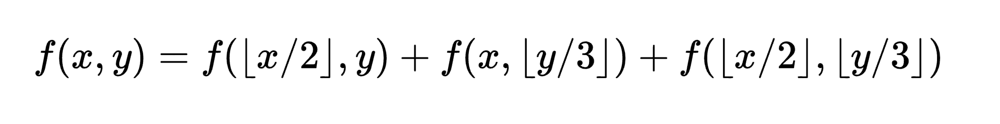

## Optimize the Recursive Funciton

A simple mathematical function is defined as:

Also a brute-force implementation of this equation is given in `optimize.cpp`

Currently it can pull inputs upto `x = 100000` and `y = 100000` in under `8700ms`, but it can do much better.

You are required to optmize the code. 
